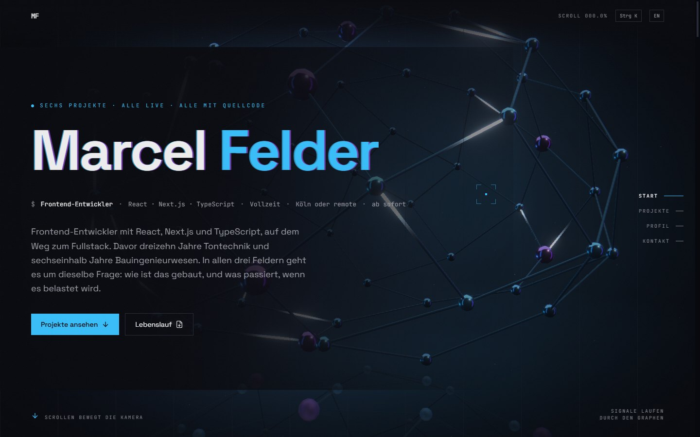
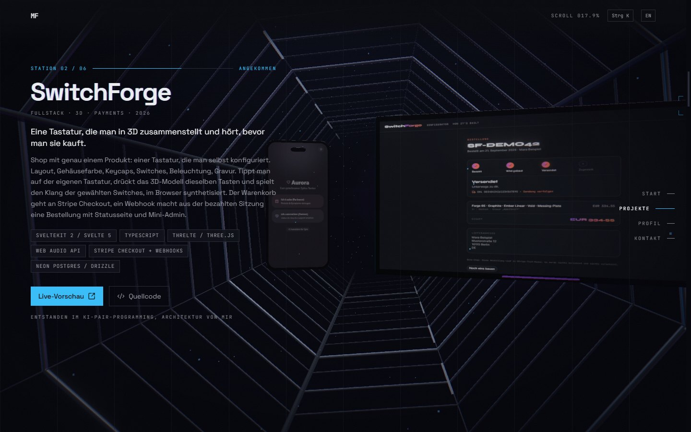
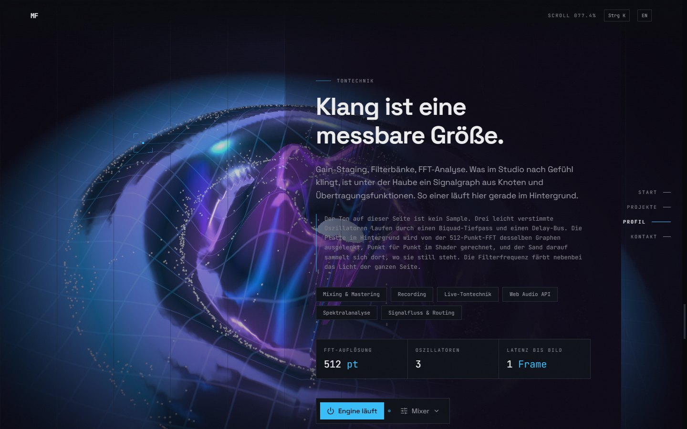
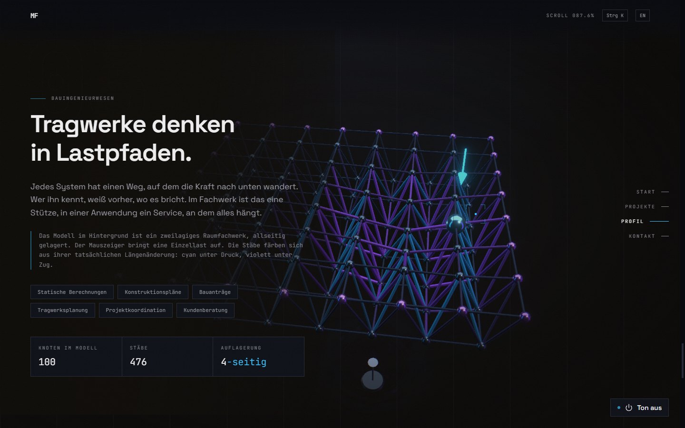
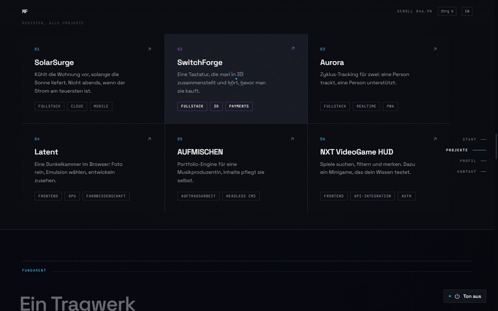
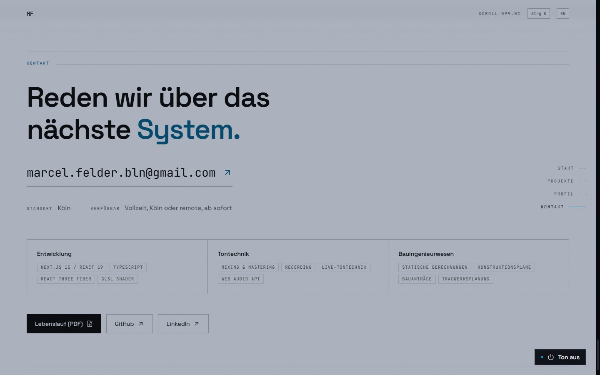

# marcelfelder

Welcome to **marcelfelder**, my developer portfolio: one scroll-driven 3D
scene, six real projects, and a sound engine you can actually hear.

The idea: I came to frontend development from thirteen years of audio
engineering and six and a half years of structural engineering. Instead of
saying that in a paragraph, the site shows it. The projects hang on the walls
of a corridor you drive through; the three chapters behind the profile each
run their own physical model: a Chladni plate driven by a live FFT, a space
frame that bends under the cursor, a component matrix with a compile sweep.

This is a self-driven portfolio project and, at the same time, the seventh
project on the list: no UI kit, no ready-made theme, no animation library for
the 3D scene.

> Built with an AI pair-programming workflow (Claude Code). I drove the
> architecture, the content and every decision about what goes on the page
> and what doesn't, and I can walk through every part of it.

## Table of Contents

- [Short Description](#short-description)
- [Showcase](#showcase)
- [Key Features](#key-features)
- [How It Works](#how-it-works)
- [Technologies Used](#technologies-used)
- [What's Real & What's Simulated](#whats-real--whats-simulated)
- [Challenges & Lessons Learned](#challenges--lessons-learned)
- [How to Get Started (Local Setup)](#how-to-get-started-local-setup)
- [Live Demo](#live-demo)
- [Notes](#notes)

## Short Description

A one-page portfolio in German and English. The hero is a dependency graph
with light travelling through its edges. Scrolling drives a camera down a
corridor where six projects hang as devices, a monitor for web apps and a
phone for mobile apps, each cycling through real screenshots. Below that, a
profile section with three chapters, one per discipline, and a contact block
with a downloadable CV.

Scope is deliberately small: one page, no CMS, no backend beyond a tiny JSON
route. The goal is to show **frontend depth** (real-time 3D, audio synthesis,
motion, typography, accessibility) with the engineering discipline behind it:
measured contrast, adaptive quality tiers, nothing invented in the content.

## Showcase

### Screenshots

<p align="center">
  
</p>
<p align="center">
  
</p>
<p align="center">
  
</p>
<p align="center">
  
</p>
<p align="center">
  
</p>
<p align="center">
  
</p>

## Key Features

- **One scene, five models.** Hero graph, project corridor and three chapter
  models are mounted at the same time. Scroll position is turned into a
  normalised, damped weight per section; every model fades in on its own
  weight, and the same weights blend the camera stations and the colour
  climate. There is no cut anywhere, only mixes.
- **Project corridor.** Six projects as devices on the walls of a tunnel,
  monitor or phone depending on orientation, with cycling stills and a card
  that switches side and height per station. Below it a plain index, so
  every project is reachable by keyboard without the ride.
- **Chladni plate.** A metal plate on a driver rod, displaced in the vertex
  shader by the 512-point FFT of the site's own audio engine. 2,600 grains of
  sand migrate down the gradient of the standing pattern and settle on the
  nodal lines. The pointer changes the mode order, the sand follows.
- **Space frame under load.** A two-layer truss, supported on all sides. The
  cursor applies a point load; members are coloured from their actual change
  in length, cyan in compression, violet in tension.
- **Audio engine, not a sample.** Three detuned oscillators through a biquad
  low-pass and a delay bus, five faders normalised to 0..1, an analyser read
  once per frame. The filter frequency tints the light of the whole page.
- **Command palette** (`Ctrl K` / `⌘ K`, or the button in the header):
  navigation, audio, `cat resume`, `ls projects`, `download cv`, `open github`.
- **Two languages, two addresses.** German on `/`, English on `/en`, each
  with its own metadata and preview image, linked by `hreflang`. No
  browser-language redirect, on purpose.
- **Adaptive quality.** Two tiers. A known-weak GPU starts low; otherwise a
  frame-rate monitor drops the tier if it stays under 45 fps. Low means
  DPR 1, no multisampling, no chromatic aberration.
- **Accessibility as a measurement.** All text colours are checked against
  all five scene grounds (`node scripts/check-contrast.mjs`); `prefers-reduced-motion`
  stills the scene; the index is real anchors; the faders are native range
  inputs; a skip link jumps past the 3D area.
- **Generated metadata.** Preview image and tab icon are rendered at build
  time from the same content and palette, in both languages.

## How It Works

```
Scroll                                   Scene (React Three Fiber)
┌────────────────────────────────┐       ┌─────────────────────────────────┐
│ ScrollDriver (one rAF loop)    │       │ Rig: camera = weighted mean of  │
│   per section: claim()         │       │      five stations + orbit +    │
│   = max(window, coverage)      │──────▶│      pointer parallax           │
│   normalise to sum 1           │weights│ Models: fade on own weight,     │
│   damp: 1 - exp(-λ·dt)         │       │      enter from own direction   │
│   → lib/scene/state.ts         │       │ Palette → scene.background, fog │
└────────────────────────────────┘       │         → CSS var --ground-rgb  │
                                         └─────────────────────────────────┘
Audio
3× Oscillator (detuned) → voiceGain → BiquadFilter (LP) ─┬→ master → Analyser → out
                                                          └→ Delay ⟲ feedback → wet ─┘
                                         Analyser (512-pt FFT) → DataTexture → plate shader
```

The weights live in a mutable module object, not in React state: they change
every frame, and a `setState` per frame would re-render the whole tree.
Zustand is used only for things that need a re-render (active chapter,
palette, audio, quality tier).

The Chladni plate and the hero tubes are standard three.js materials with
`onBeforeCompile` injections: displacement and analytic normal at
`<beginnormal_vertex>` / `<begin_vertex>`, colour and grid at
`<color_fragment>` / `<emissivemap_fragment>`. Lighting, environment
reflections and tone mapping stay three's job. Uniforms are handed over by
reference with `Object.assign(shader.uniforms, ...)`, which is why the plate
is visible at all (see lessons).

All tempo knobs (stations per screen, still hold time, damping) sit in
`lib/scene/pacing.ts`. `lib/scene/*` never imports three, and everything under
`components/canvas/` hangs behind a dynamic import, so First Load JS stays
around 115 kB with the 3D chain loading afterwards.

## Technologies Used

- **Framework:** Next.js 15 (App Router, Turbopack), React 19, TypeScript
- **Styling:** Tailwind v4 with design tokens in `@theme`, no config file
- **3D:** three.js via React Three Fiber 9, drei, PBR with a self-built
  lightformer environment, custom GLSL injections, `@react-three/postprocessing`
  (Bloom, Chromatic Aberration, Vignette on an opaque canvas)
- **Audio:** Web Audio API, no samples
- **Motion:** Framer Motion for the DOM, `useFrame` for the scene
- **State:** Zustand for re-render state, a mutable module for per-frame state
- **Tooling:** cmdk (palette), `next/og` (preview image, icon), Vercel
  Analytics and Speed Insights (cookieless)
- **Hosting:** Vercel (Hobby tier), no environment variables needed

## What's Real & What's Simulated

| Part                        | Status                                                                                                   |
| --------------------------- | -------------------------------------------------------------------------------------------------------- |
| Projects                    | **Real.** Six deployed projects with source; texts come from their READMEs, screenshots from the apps     |
| Résumé and contact          | **Real.** Content matches the CV that is downloadable on the page; nothing is invented                    |
| FFT and audio               | **Real.** Synthesised in the browser, analysed live; the plate reacts one frame behind the sound          |
| Chladni pattern             | **Model, not physics.** A standing-wave formula (angular order × radial cosine) plus a travelling wave; the sand follows only the standing part, because a travelling wave has no fixed nodes |
| Space frame deformation     | **Influence function, not FEM.** A Gaussian around the load point times a support mask; members are coloured from the resulting length change |
| Frame rate in chapter 01    | **Measured**, from the running scene                                                                     |
| Quality tier                | **Measured.** GPU heuristic at start, frame-rate monitor afterwards, remembered per session               |
| `/api/profile`              | **Real** JSON route with the same content the page shows                                                 |

## Challenges & Lessons Learned

- **A ShaderMaterial copies its uniforms.** Writing to my own uniforms object
  after `new ShaderMaterial({ uniforms })` changed nothing, and the plate
  stayed invisible without any error. Found it with a fragment shader that
  paints everything red. Fix: hand uniforms over by reference inside
  `onBeforeCompile`.
- **Bloom needs an opaque canvas.** The EffectComposer doesn't pass alpha
  through a transparent canvas and lays the bloom over the page as a grey
  veil. The canvas is opaque now and the scene paints its own ground.
- **Blend modes over WebGL kill Macs.** Full-screen `mix-blend-mode` layers
  above the canvas force the compositor to copy the whole frame each frame;
  together with 8× MSAA at DPR 1.75 that turned a MacBook into a slideshow.
  Blend modes are gone, MSAA is 2 (0 in the low tier), and there is a quality
  guard.
- **Everything is a weighted mean, so weights must sum to 1.** Clamping
  each section's weight with `min(1, w)` lets two sections claim 0.8 each,
  and the camera ends up 1.6× too far out. Normalise first, damp second.
- **Exported values from a "use client" module are references, not values.**
  `LOCALES.map` was suddenly "not a function" in `generateStaticParams`.
  Constants live in a plain module now; the React context in a client one.
- **A middleware redirect can eat your preview image.** Redirecting
  `/de/*` to `/` also redirected `/de/opengraph-image`, so every shared German
  link would have shown an empty card. Only `/de` itself is redirected now.
- **Two dev servers on one `.next` folder** produce `EPERM` on
  `.next/trace`, and `next build` while `next dev` runs produces
  `Internal Server Error`. Stop one before starting the other.
- **Screenshots lie about mobile.** A 462 px document in a 390 px viewport
  made Chrome zoom the whole layout out; every mobile screenshot looked
  slightly wrong for a reason nobody could see. `overflow-x: clip` on both
  `html` and `body`, measured afterwards.
- **A headline can be too clever.** Eight attempts at a tagline, none of
  them held up. The hero is the name now, the proof is the eyebrow above it,
  the facts are the line below.

## How to Get Started (Local Setup)

Prerequisites: Node 20+.

```bash
npm install
npm run dev                   # http://localhost:3000
```

There is nothing to configure. For a production build:

```bash
npm run build                 # stop the dev server first, both write to .next
npm start
```

Useful while working on it:

```bash
node scripts/check-contrast.mjs   # every text token against every scene ground
```

Content lives in `content/`: `projects.ts` (six projects, English texts at
the bottom), `resume.ts` / `resume.en.ts` (chapters, manifest, background),
`site.ts` (contact, availability, CV paths), `ui.ts` (every label in both
languages, typed against the German object so nothing can go missing).

## Live Demo

- German: https://marcelfelder.vercel.app
- English: https://marcelfelder.vercel.app/en

## Notes

- Preview image, sitemap and canonical URL derive from
  `VERCEL_PROJECT_PRODUCTION_URL` at build time; `NEXT_PUBLIC_SITE_URL`
  overrides it if a custom domain comes along.
- The audio engine only starts on a user gesture (autoplay policy) and its
  controls live in the sound chapter, where you can see what they do.
- Fonts: Space Grotesk and JetBrains Mono via `next/font`; Space Grotesk Bold
  is also checked in as a TTF for the generated preview image (OFL).
